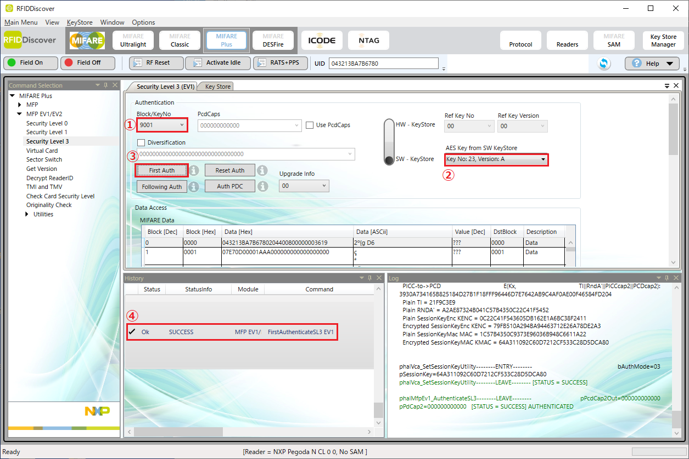

<!-- omit in toc -->
# グラモMFPエンコード確認メモ

## 1. 目次
- [1. 目次](#1-目次)
- [2. 概要](#2-概要)
  - [2.1. 使用する機器](#21-使用する機器)
  - [2.2. エンコード仕様](#22-エンコード仕様)
    - [2.2.1 鍵値](#221-鍵値)
    - [2.2.2 可変データ例](#222-可変データ例)
    - [2.2.3 固定データ](#223-固定データ)
- [3. 事前準備](#3-事前準備)
- [4. カードへの鍵の書き込み確認](#4-カードへの鍵の書き込み確認)
- [5. 可変データの書き込み確認](#5-可変データの書き込み確認)
- [5.1. ブロック0001hとブロック0002hの確認](#51-ブロック0001hとブロック0002hの確認)
- [5.2. ブロック0003hの確認](#52-ブロック0003hの確認)
- [6. 改訂履歴](#6-改訂履歴)

## 2. 概要
本メモではグラモ様向けMIFARE Plusのエンコード確認方法案を示します。
### 2.1. 使用する機器
  - Windowsパソコン
  - NXPリーダライタ（Pegoda）
  - NXPソフトウェア（RFID Discover）
  
### 2.2. エンコード仕様
各ブロックの書込値は以下の通り。

#### 2.2.1 鍵値
```text
9000 : 9000AAAA9000BBBB9000CCCC9000DDDD
9001 : 9001BBBB9001CCCC9001DDDD9001EEEE
4000 : 4000AAAA4000BBBB4000CCCC4000DDDD
4001 : 4001AAAA4001BBBB4001CCCC4001DDDD
```

#### 2.2.2 可変データ例
```text
0001 : 07E70D00001AAA000000000000000000
0002 : 32C3A336F38E4E91AF11FD3F89B015CF
```

#### 2.2.3 固定データ
```text
0003 : 00000000000F0F0F0F00000000000000
```


## 3. 事前準備
RFID DiscoverのKEY Storeに今回の検査で使用する鍵を登録しておきます。


上の例ではKeyNo.20に4000ブロック、KeyNo.21に4001ブロック、KeyNo.22に9000ブロック、KeyNo.23に9001ブロックの鍵を各々登録しています。

## 4. カードへの鍵の書き込み確認
4つの鍵がカードに正しく書き込まれていることを確認します。

1. 9000hの鍵

SeculityLevel3のメニューを開き、Block/KeyNoで9000を選択（⑦）、KeyStoreKeyで9000hの鍵を登録した番号を選択（⑧）、FirstAuthを実行（⑨）してSUCCESS（⑩）が表示されればOKです。

2. 9001hの鍵


3. 4000hの鍵


4. 4001hの鍵


## 5. 可変データの書き込み確認

## 5.1. ブロック0001hとブロック0002hの確認

Block/KeyNoで4000を選択（①）、KeyStoreKeyで4000hの鍵を登録した番号を選択（②）、FirstAuthを実行します（③）。


DataAccessでBlock0000/0001/0002を選択し（①）MAConCommandとMAConResponseのチェックが入っていることを確認、Readボタンを押します（③）。


SUCCESSが表示され（④）、ブロック0001とブロック0002の読み出しデータが[2.2.2](#222-可変データ)に示した可変データと一致していればOKです（⑤）。

## 5.2. ブロック0003hの確認

DataAccessでBlock0003を選択し（①）Readボタンを押します（②）。


SUCCESSが表示され（③）、ブロック0003の読み出しデータが[2.2.3](#223-固定データ)に示した固定データと一致していればOKです（④）。


## 6. 改訂履歴
- 1.0:
  - 作成日時: 2023-04-17
  - 更新内容: 初版作成
